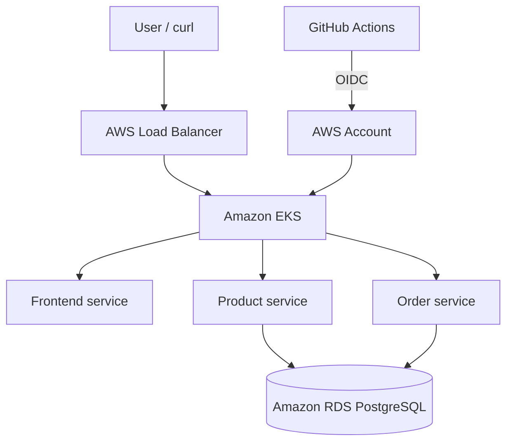

# E-Commerce DevOps Platform

This project deploys a small e-commerce application on AWS EKS. It has three services: Frontend, Product, and Order. Product and Order use a private PostgreSQL database in Amazon RDS.

The infrastructure is created with Terraform and the application is deployed through Kubernetes manifests. I also configured HPA for Product and Order, tested pod self-healing, and enabled CloudWatch Container Insights for logs and metrics.

## Architecture



## What is running

| Component                     | Notes                                          |
| ----------------------------- | ---------------------------------------------- |
| Frontend                      | Entry point for the application                |
| Product service               | Handles product APIs                           |
| Order service                 | Handles order APIs                             |
| Amazon EKS                    | Runs the Kubernetes workloads                  |
| Amazon RDS PostgreSQL         | Private database used by Product and Order     |
| AWS Load Balancer             | Public endpoint for the application            |
| Terraform                     | Used to provision the AWS infrastructure       |
| GitHub Actions + OIDC         | Prepared for CI/CD without long-lived AWS keys |
| CloudWatch Container Insights | Centralized logs and EKS metrics               |

All application resources are deployed in the `ecommerce` namespace.

```bash
kubectl get all -n ecommerce
```

## Accessing the application

The application is exposed through the AWS Load Balancer.

```bash
curl -i "http://<LOAD_BALANCER_URL>/products" \
  -H "Authorization: Bearer my-demo-token"
```

Example request to add a product:

```bash
curl -i -X POST "http://<LOAD_BALANCER_URL>/products" \
  -H "Authorization: Bearer my-demo-token" \
  -H "Content-Type: application/json" \
  -d '{"name":"Laptop","price":55000,"stock":10}'
```

## Autoscaling

Product and Order use Horizontal Pod Autoscalers.

| Service | Min replicas | Max replicas | CPU target |
| ------- | -----------: | -----------: | ---------: |
| Product |            1 |            3 |        60% |
| Order   |            1 |            3 |        60% |

For the demo, I reduced the scale-down stabilization window to 30 seconds so the scale-down is visible shortly after load is removed.

```bash
kubectl get hpa -n ecommerce
kubectl describe hpa product-hpa -n ecommerce
```

To create load against the Product API:

```bash
kubectl create deployment load-generator -n ecommerce \
  --image=busybox:1.36 -- \
  /bin/sh -c 'while true; do wget -q -O- http://product:5001/products >/dev/null; done'

kubectl scale deployment load-generator -n ecommerce --replicas=10
```

Watch the HPA and pods:

```bash
kubectl get hpa -n ecommerce -w
kubectl get pods -n ecommerce -w
```

Remove the load generator after the test:

```bash
kubectl delete deployment load-generator -n ecommerce
```

## Self-healing test

The services are managed by Kubernetes Deployments. If a Product pod is deleted, Kubernetes starts another pod automatically.

```bash
kubectl get pods -n ecommerce -l app=product
kubectl delete pod -n ecommerce <PRODUCT_POD_NAME>
kubectl get pods -n ecommerce -l app=product -w
```

## Database

The application uses a private RDS PostgreSQL instance.

| Property      | Value                     |
| ------------- | ------------------------- |
| Instance      | `ecommerce-demo-postgres` |
| Engine        | PostgreSQL                |
| Database      | `ecommerce`               |
| Port          | `5432`                    |
| Public access | Disabled                  |

The database is not exposed to the internet. Application pods connect to it from inside the VPC.

To inspect it from the cluster:

```bash
kubectl run postgres-client -n ecommerce --rm -it --restart=Never \
  --image=postgres:16 -- \
  psql "host=ecommerce-demo-postgres.cvu0meea4fcy.ap-south-1.rds.amazonaws.com port=5432 dbname=ecommerce user=app sslmode=require" -W
```

Useful SQL commands:

```sql
\dt
SELECT * FROM products;
SELECT * FROM orders;
```

## Logging and monitoring

CloudWatch Observability is enabled on the EKS cluster using the `amazon-cloudwatch-observability` add-on with EKS Pod Identity.

The following components are running in the `amazon-cloudwatch` namespace:

* `cloudwatch-agent` for metrics
* `fluent-bit` for container logs
* `kube-state-metrics` for Kubernetes workload state
* `node-exporter` for worker-node metrics
* `cloudwatch-agent-cluster-scraper` for cluster metrics

```bash
kubectl get pods -n amazon-cloudwatch
```

The add-on status was verified as active:

```bash
aws eks describe-addon \
  --cluster-name ecommerce-demo \
  --addon-name amazon-cloudwatch-observability \
  --region ap-south-1 \
  --query "addon.status" \
  --output text
```

CloudWatch log groups created for the cluster:

```text
/aws/containerinsights/ecommerce-demo/application
/aws/containerinsights/ecommerce-demo/dataplane
/aws/containerinsights/ecommerce-demo/host
/aws/containerinsights/ecommerce-demo/performance
```

Container Insights shows cluster, node, namespace, pod, and container metrics such as CPU, memory, ready pod count, and restart status. Fluent Bit automatically discovers logs from new pods created during HPA scaling or pod recovery.

Useful troubleshooting commands:

```bash
kubectl logs -n ecommerce deployment/product --tail=100
kubectl logs -n ecommerce deployment/order --tail=100
kubectl get events -n ecommerce --sort-by=.lastTimestamp
kubectl get pods -n ecommerce -w
```

For this demo, CloudWatch log retention should be kept low, for example 7 days, to control cost.

## CI/CD and security

* Terraform is used for infrastructure provisioning.
* GitHub OIDC is configured for AWS authentication.
* No long-lived AWS access keys need to be stored in the GitHub repository.
* The RDS database is private.
* Kubernetes resources are isolated in the `ecommerce` namespace.
* API requests use bearer-token authentication.

## Current limitations / next steps

* `DELETE /orders/{id}` is not implemented yet and returns `405 Method Not Allowed`.
* Application logs are currently basic Gunicorn logs. Structured JSON logs with request IDs would make troubleshooting easier.
* Add CloudWatch alarms for high CPU, repeated pod restarts, and RDS health.
* Enable EKS control-plane logs such as API server, Audit, and Authenticator for deeper Kubernetes troubleshooting.
* Add unit tests, integration tests, image scanning, and code-quality checks to the CI pipeline.
* Keep separate development, staging, and production environments for a production setup.

## What was demonstrated

* Application access through an AWS Load Balancer
* EKS pod self-healing after pod deletion
* HPA scale-out from 1 to 3 replicas
* Automatic scale-down after load removal
* Private RDS PostgreSQL connectivity
* Terraform-managed AWS infrastructure
* GitHub OIDC-based AWS authentication
* CloudWatch logs and Container Insights metrics for EKS
